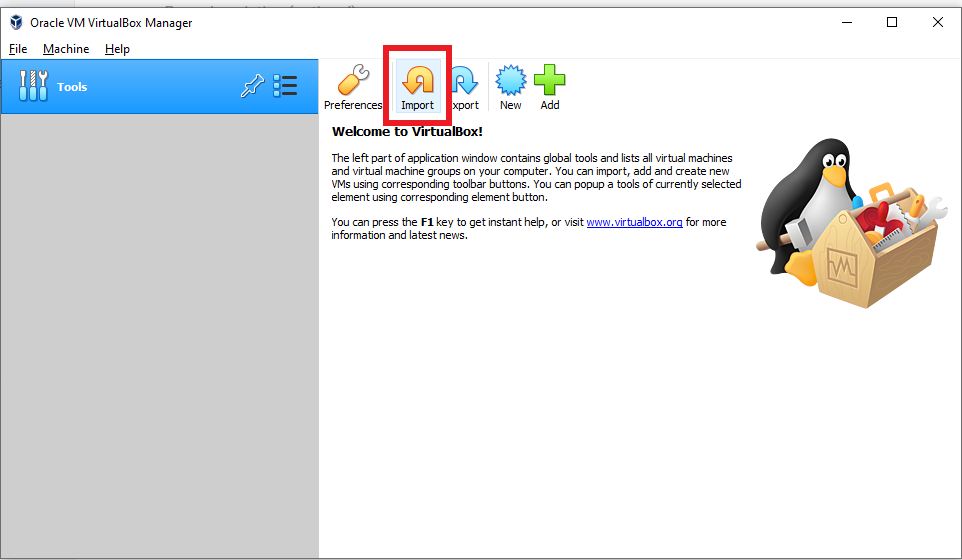
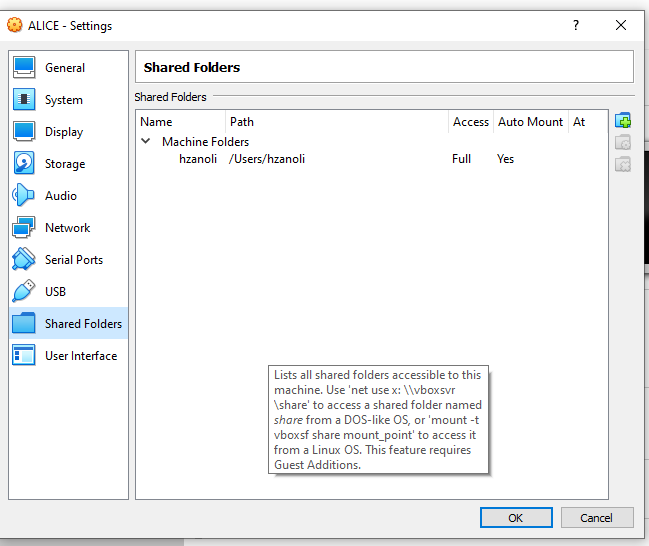
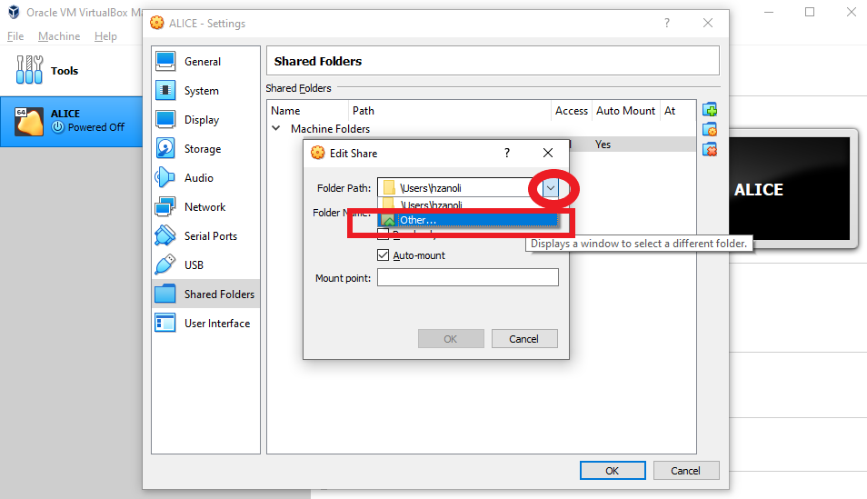

# Use the ALICE software in a virtual machine

An easy way to install the software is to get a virtual machine, with some pre installed packages.
Check with your supervisor if that is the software you are going to use.

The virtual machine has the following software:

- Cern CentOS 7
- AliPhysics installed with option ``user-next-root6``, which includes:
  - ROOT 6
  - fastjet
  - AliRoot
  - AliPhysics

Additional software can be installed, please get in touch with [Henrique](mailto:henrique.zanoli@cern.ch).

Now you can follow the steps bellow to get the virtual machine running.

## Install the virtual machine software

### What are virtual machines?

A [virtual machine](https://en.wikipedia.org/wiki/Virtual_machine) emulates a whole computer in your own computer.
The size of the virtual machine is large, since you are packing a whole operation system and all the components
necessary to run the ALICE software. The total size is approximately 30 GB. Please be sure that you have enough space
before installing. It is recommended to have at least 40 GB of free space on your computer
(10 GB to download and 30 GB to install).

### Install VirtualBox

For this setup, the only software you will need is VirtualBox. You can also use another virtual machine software, but
this tutorial only covers the instructions for VirtualBox.
You can download it in the [VirtualBox website](https://www.virtualbox.org/wiki/Downloads).

The installation process is straightforward. If you have problems, the
[VirtualBox User manual](https://www.virtualbox.org/manual/) has detailed instructions, particularly on
[Chapter 2](https://www.virtualbox.org/manual/ch02.html). You should just click "Next" and "Install"
in any popup windows that might show.

### Install VirtualBox Extensions

The extensions will give you a better performance and more feature, so please download the extension pack. It is on the
same page you downloaded [VirtualBox website](https://www.virtualbox.org/wiki/Downloads). Simply click on the link
*All supported platforms*, bellow *VirtualBox <version> Oracle VM VirtualBox Extension Pack* .

Double click the file, it will open the VirtualBox application and a popup. Click in ``Install``.

Accept again any requests from the program and you are set. The software is ready to be used.

## Importing the VM

First, you need to download the image file. The VM images are available in the SURFdrive,
click on [this link](https://surfdrive.surf.nl/files/index.php/s/yWG0XgtqZPMs1jD) to download. The file has 11GB.

Open the app you just installed, ``Oracle VM VirtualBox``, and click in ``Import``.

It will open a new window called ``Import Virtual Assistance``. Click on the Icon on the right to ``Find a File``.
Select the file with the VM \(for example, ``ALICE.ova``) and select click in ``Open`` to confirm.
Then you are back to the previous screen and you can click on ``Next``.

This will load the **Appliance settings** screen, as seen bellow. This gives the details of the Virtual Machine.
The current values are a suggestion that should work for most people. If you have 8 GB of RAM and a dual
core processor \(or more\), you can leave as it is. If you are not sure, you can check it on
[Windows](https://support.microsoft.com/en-us/help/13443/windows-which-version-am-i-running),
[Mac](https://support.apple.com/guide/system-information/get-system-information-syspr35536/mac)
or [Ubuntu](https://askubuntu.com/questions/55609/how-do-i-check-system-specifications).

!!! warning
    If you have less than 8 GB of RAM, please change the RAM value to a lower value, such as 2048 MB or 3072 MB.

Now click in **Import**.

This will import the Virtual Machine. It might take a while, be patient. Once finished, you should see that the
Virtual Machine will be imported, as shown bellow.

Now let's configure your shared folder. The shared folder will let and edit you see a particular of your computer
in the Virtual Machine.

!!! caution
    For security reasons, do not share all your drive, but only a subset of it, such as your
    personal folder. To configure it, click in **Settings**.

In the new screen, click on Shared Folders.

In this window, Click on **hzanoli** and then in **Edit share** \(the second item on the right\),
as shown in the figure bellow.

Now add, change the folder that will be shared. First click on the arrow on the left and in the drop down menu,
select **Other**.

In this new menu, select your user folder (or other folder you would prefer to share between your machine and the VM)
and click on **Select Folder**.

Now, check that **Auto-mount** is selected. If not, select it. In **Folder Name**, you can add the name you would like.
For example, you can leave the automatic name generated by the program (which will be your username) or to call it
_alice_. Then click **OK** and **Ok** again.

Now your machine should be fully configured for our needs. You can now go to the next step,
running the machine.

## Running the VM

Now, on **Oracle VM VirtualBox** main screen, you can click on the VM you just imported, **ALICE**,
and click on **Start.**

Wait, the machine will automatically login and open the Desktop. If it does not login automatically, 
you will need to type the password: ``quarkgluon``. You will also need this password in case you would like to 
install additional software. Now you can use it! 

To open the a program, for example the Terminal, you can click on **Activities** on the top left and type in the
search box.

To open the Alice environment, just type ``ali`` in the terminal.

The machine includes Emacs and sublime text to edit text, but you can in principle add anything you would like.

