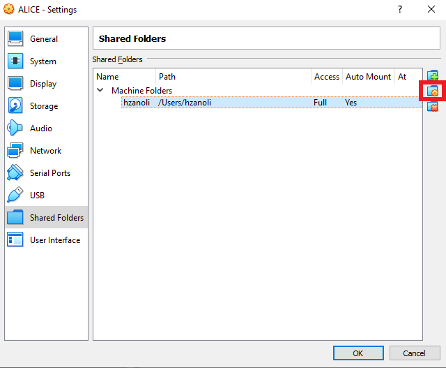
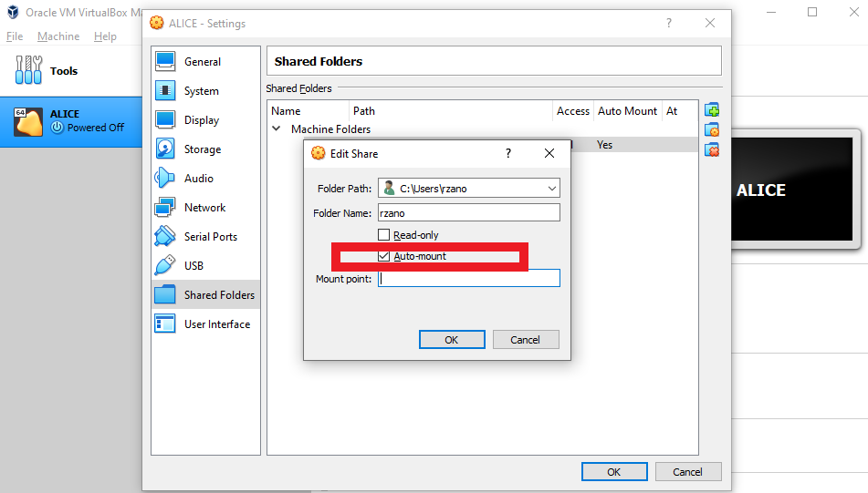

# Importing the VM

First, you need to download the image file. The VM images are available in the SURFdrive, click on [this link](https://surfdrive.surf.nl/files/index.php/s/hixP7HtZlOASXq6) to download. The file has 11GB. 

Open the app you just installed, **Oracle VM VirtualBox,** and click in **Import**

It will open a new windows called **Import Virtual Assistance**. Click on the Icon on the right to **Find a File**. Select the file with the VM \(_ALICE.ova_\) and select click in **Open** to confirm. Then you are back to the previous screen and you can click on **Next**.

This will load the **Appliance settings** screen, as seen bellow. This gives the details of the Virtual Machine. The current values are a suggestion that should work for most people. If you have 8 GB of RAM and a dual core processor \(or more\), you can leave as it is. If you are not sure, you can check it on [Windows](https://support.microsoft.com/en-us/help/13443/windows-which-version-am-i-running), [Mac](https://support.apple.com/guide/system-information/get-system-information-syspr35536/mac) or [Ubuntu](https://askubuntu.com/questions/55609/how-do-i-check-system-specifications). If you have less than 8 GB of RAM, please change the RAM value to a lower value, such as 2048 MB or 3072 MB.

Now click in **Import**.

This will import the Virtual Machine. It might take a while, be patient. Once finished, you should see that the Virtual Machine will be imported, as shown bellow.

Now let's configure your shared folder. The shared folder will let and edit you see a particular of your computer in the Virtual Machine. For security reasons, do not share all your drive, but only a subset of it, such as your personal folder. To configure it, click in **Settings**.

In the new screen, click on Shared Folders.

In this window, Click on **hzanoli** and then in **Edit share** \(the second item on the right\), as shown in the figure bellow.

Now add, change the folder that will be shared. First click on the arrow on the left and in the drop down menu, select **Other**.

In this new menu, select your user folder (or other folder you would prefer to share between your machine and the VM) and click on **Select Folder**.

Now, check that **Auto-mount** is selected. If not, select it. In **Folder Name**, you can add the name you would like. For example, you can leave the automatic name generated by the program (which will be your username) or to call it _alice_. Then click **OK** and **Ok** again.

Now your machine should be fully configured for our needs. You can now go to the next step, [running the machine](running-your-vm.md).